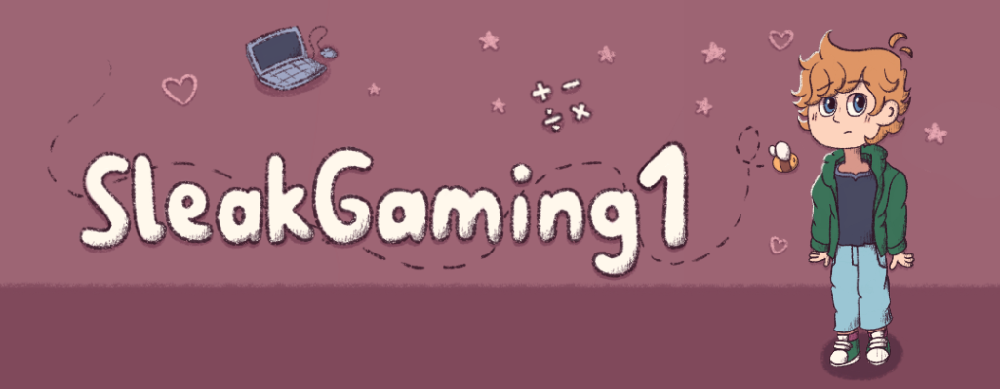

  

# Hey there 👋

- 🔭 Beginner PM5 plugin developer
- 🎨 Beginner UI/UX designer
- 🤔 Enjoys UI/UX Design, Minecraft development, and HTML/CSS web development
- 😄 Pronouns: He/Him

## Links

 

## Languages and Tools

